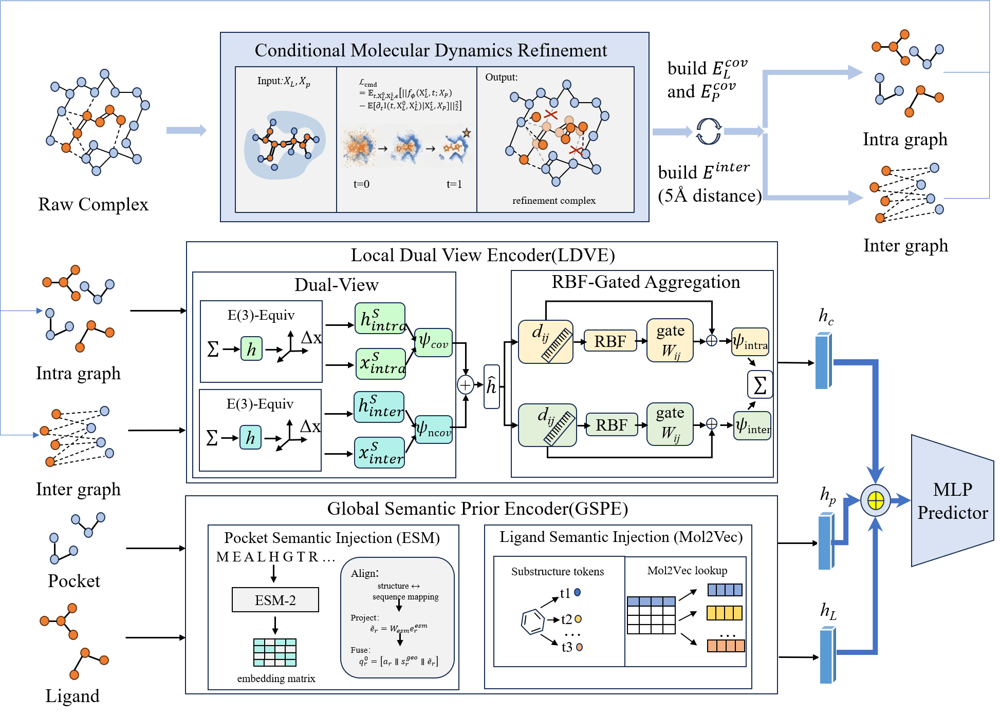

# CMD-PLA

Official code repository for **Conditional Molecular Dynamics Refinement for Protein-Ligand Affinity Prediction**.

## Authors

Hao Li, Dongjiang Niu, Xiaofeng Wang, Zhiqiang Wei, and Zhen Li.

Affiliations include Qingdao University, MindRank AI Ltd, Ocean University of China, Shandong Provincial Key Laboratory of Intelligent Molecular Science and Engineering, and Shandong Provincial Key Laboratory of Pathogenesis and Prevention of Brain Diseases.

## Overview

CMD-PLA is a dynamics-aware framework for protein-ligand affinity prediction. It models ligand conformational refinement as a pocket-conditioned molecular dynamics process, then combines local geometric interaction modeling with global semantic priors for robust affinity regression.

## Model Framework



The framework contains three main stages:

1. **Conditional Molecular Dynamics Refinement (CMD-Refine):** refines ligand coordinates under pocket geometric constraints to reduce sensitivity to initial pose noise.
2. **Local Dual View Encoder (LDVE):** constructs intra-view covalent graphs and inter-view ligand-pocket contact graphs, then applies E(3)-equivariant message passing and RBF-gated aggregation.
3. **Global Semantic Prior Encoder (GSPE):** introduces pocket-level ESM representations and ligand-level Mol2Vec representations, which are fused with local complex features and decoded by an MLP predictor.

## Repository Structure

```text
.
+-- CMD_PLA_main/
|   +-- CMD_core/              # CMD molecular geometry module
|   +-- config_hg/             # training configuration
|   +-- log/                   # logging helpers
|   +-- dataset.py             # graph dataset and data loader
|   +-- HG.py                  # main hybrid graph model
|   +-- preprocessing.py       # data preprocessing utilities
|   +-- train.py               # training script
|   +-- predict.py             # evaluation / prediction script
+-- docs/
|   +-- github-profile-snippet.md
+-- cmd_pla_framework.png      # model framework diagram
+-- CITATION.cff
+-- requirements.txt
+-- README.md
```

## Requirements

```text
biopython==1.79
networkx==3.2.1
numpy==1.23.5
pandas==2.2.1
pymol==3.0.0
python==3.10.0
rdkit==2023.9.5
scikit-learn==1.4.1
scipy==1.12.0
torch==2.0.1
torch-geometric==2.5.2
tqdm==4.66.2
```

Install the Python packages with:

```bash
pip install -r requirements.txt
```

PyTorch and PyTorch Geometric should be installed with versions matching your CUDA environment.

## Data

Place processed datasets under `CMD_PLA_main/data/` or update `data_root` in `CMD_PLA_main/config_hg/TrainConfig.json`.

The scripts expect dataset splits such as:

```text
data/
+-- PDBbind/
+-- CASF_2013/
+-- CASF_2016/
+-- train.csv
+-- valid.csv
+-- test.csv
+-- test_2013.csv
+-- test_2016.csv
```

Large datasets, trained checkpoints, and generated outputs are intentionally excluded from this repository.

## Training

Edit `CMD_PLA_main/config_hg/TrainConfig.json` to select the dataset path, GPU id, batch size, number of epochs, and model-saving directory.

```bash
cd CMD_PLA_main
python train.py
```

## Prediction

After preparing the data and checkpoints, run:

```bash
cd CMD_PLA_main
python predict.py
```

## Citation

```bibtex
@article{li2026cmdpla,
  title   = {Conditional Molecular Dynamics Refinement for Protein-Ligand Affinity Prediction},
  author  = {Li, Hao and Niu, Dongjiang and Wang, Xiaofeng and Wei, Zhiqiang and Li, Zhen},
  year    = {2026},
  url     = {https://github.com/lihaoaaa882-oss/CMD-PLA}
}
```

## License

Please add a license before public reuse. Common academic code-release choices include MIT, Apache-2.0, and BSD-3-Clause.
